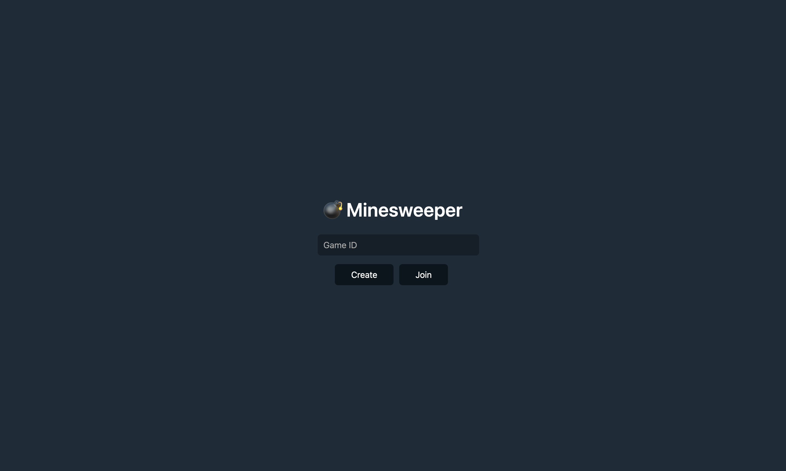

<p align="center">
    
</p>

# Go CSCI-343 Group Project (Go-Minesweeper-Multiplayer)


**Created by Gabe & Bryant**

This is a multiplayer minesweeper game using Go and Gin. It is a web application that allows multiple users to play a game of minesweeper.

## ⭐ Screenshots

<p align="center">
    
</p>

<p align="center">
    
</p>

<p align="center">
    
</p>

<p align="center">
    
</p>

## 📜 Prerequisites

Make sure you have Go installed on your system. You can download Go from [here](https://go.dev/dl/). **You must download go version 1.21 or higher.**

## 📋 Setup

**Step 1** 

Clone the repository

```bash
git clone https://github.com/Guuzzeji/go-minesweaper-multiplayer.git
```


**Step 2** 

Open the project directory and run `go run main.go` or `make go-run` to start the server.

You can also run `make build-run` to run it locally as a static binary. If you use `make build-run`, make sure to do `make build-local` first to build the server for your mac.


**Step 3** Go to `http://localhost:8080` to play the game

## License

This project is licensed under the MIT License - see the [LICENSE](./LICENSE) file for details


